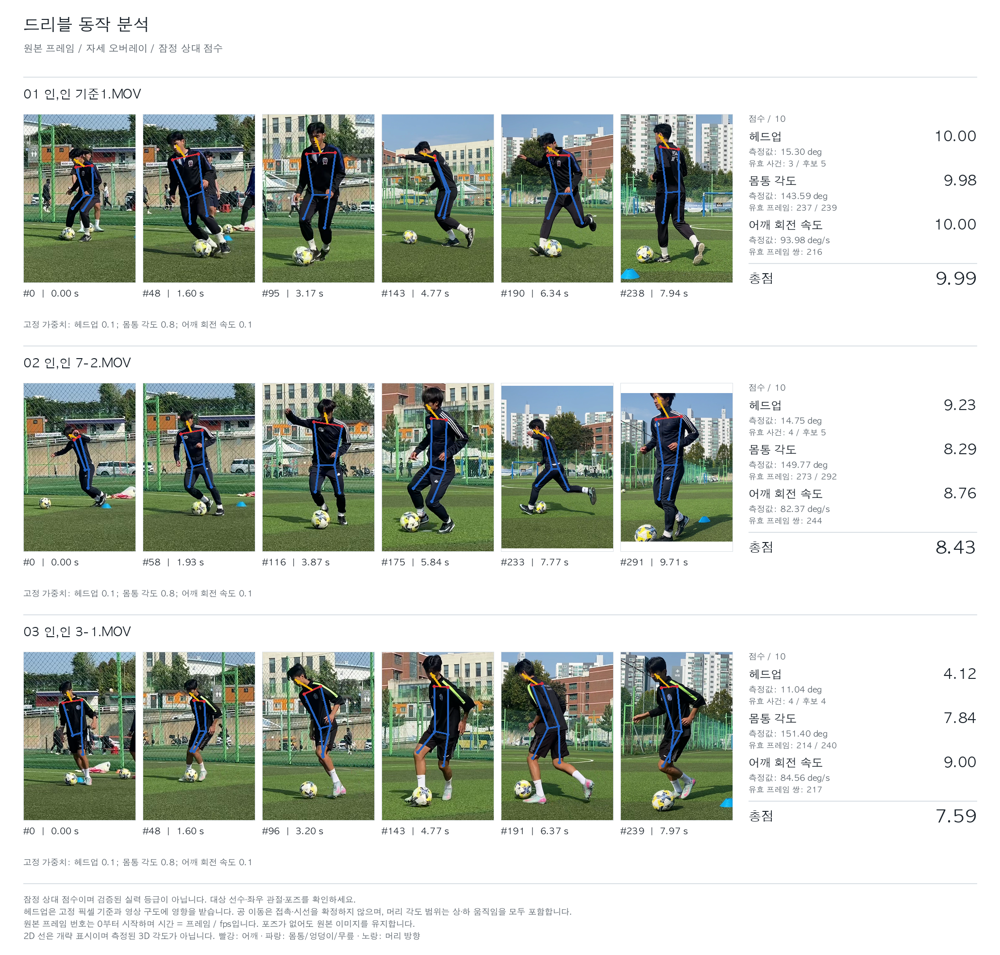

# Soccer Dribble Motion Analysis

**원본 드리블 영상을 넣으면 헤드업, 상체 각도, 어깨 속도와 총점을 계산하고, 실제 장면을 이어 붙인 파노라마 보고서를 만듭니다.**

한 영상은 한 줄로 표시합니다. 여러 영상을 함께 입력하면 같은 점수 기준으로 나란히 비교할 수 있습니다. 이미지의 장면은 원본 시간 순서대로 선택한 프레임이며, 배경을 합성한 영상은 아닙니다.



> 현재 점수는 고정된 환산 기준을 사용하는 **연구용 비교 점수**입니다. 전문가의 전체 드리블 등급을 예측하는 검증된 모델은 아닙니다. 추적이 잘못된 사람에게 붙는지와 공 방향 전환 후보가 실제 접촉에 대응하는지는 원본에서 확인해야 합니다.

[예시 보고서 파일](docs/example-report.html) | [계산 방법](docs/methods.md) | [실행 검증 기록](docs/validation.md) | [이전 코드에서 바뀐 점](docs/migration.md)

## 1. 설치

Python **3.11**을 사용합니다. CPU만으로 실행할 수 있으며 별도 서버나 API 키는 필요하지 않습니다. 최초 패키지와 모델 설치에는 인터넷이 필요합니다. 설치 후 추론은 로컬에서 실행합니다.

```bash
git clone --depth 1 https://github.com/jiwoo1105/soccer_motion_analysis.git
cd soccer_motion_analysis
python3.11 -m venv .venv
source .venv/bin/activate
python -m pip install --upgrade pip
python -m pip install -r requirements.txt
python scripts/setup_models.py
```

Windows에서는 `py -3.11 -m venv .venv`로 생성하고 PowerShell에서 `.venv\Scripts\Activate.ps1`로 활성화합니다. 이 저장소의 원본 영상 추론 검증 환경은 macOS Apple Silicon입니다. 다른 환경의 검증 범위는 [검증 기록](docs/validation.md)에 구분합니다.

마지막 명령은 공식 배포처에서 MediaPipe Pose Heavy와 YOLO11s 모델을 내려받아 SHA-256을 확인합니다. 모델 파일과 원본 영상은 Git에 포함하지 않습니다. `analyze_video.py`는 모델이 없으면 설치 방법을 안내하고 종료합니다.

```bash
# 이미 설치된 모델을 다운로드 없이 확인
python scripts/setup_models.py --check

# 공식 모델 파일이 이미 있는 경우 로컬 파일 사용
python scripts/setup_models.py \
  --pose-source /path/to/pose_landmark_heavy.tflite \
  --yolo-source /path/to/yolo11s.pt
```

오프라인 설치에서도 동일한 공식 모델 해시를 확인합니다. 임의로 학습한 다른 모델을 분석에 사용할 때는 `analyze_video.py --model /path/to/custom.pt`로 지정합니다. 다른 모델의 결과는 기본 모델과 같다고 보장하지 않습니다.

## 2. 영상 한 편 분석

촬영 영상은 화면에 분석할 선수 한 명이 충분히 크게 보이고, 머리부터 발과 공까지 포함되는 인사이드 드리블을 권장합니다. 현재 설정은 약 30fps의 기존 촬영 자료를 기준으로 정했습니다.

```bash
mkdir -p input
# 분석할 영상을 input/my_dribble.mp4 로 복사
python analyze_video.py \
  --video "input/my_dribble.mp4" \
  --output "output/my_dribble" \
  --device cpu
```

파일명에 점수나 등급을 넣을 필요가 없습니다. 파일명은 화면의 이름으로만 사용하고 계산에는 사용하지 않습니다. 이미 존재하는 출력 폴더에는 덮어쓰지 않으므로 재실행할 때 `output/my_dribble_v2`처럼 새 이름을 지정합니다.

완료 후 **`output/my_dribble/report.html`을 브라우저로 열면 됩니다.** 인터넷 연결 없이 그림과 점수표를 볼 수 있습니다. HTML을 공유할 때는 같은 폴더의 `panorama.png`도 함께 전달합니다.

## 3. 여러 영상 비교

```bash
python analyze_video.py \
  --video "input/reference.mp4" "input/player_a.mp4" "input/player_b.mp4" \
  --output "output/comparison" \
  --device cpu
```

입력 순서대로 파노라마 행이 만들어집니다. `reference.mp4`라는 이름을 붙여도 자동으로 10점을 주지 않습니다. 모든 영상에 `configs/scoring.json`의 동일한 환산 기준을 적용합니다.

| 결과 파일 | 용도 |
|---|---|
| `panorama.png` | 실제 장면 6장, 관절 표시, 세 항목 점수와 총점 |
| `report.html` | 파노라마, 원시값과 점수표, 계산 불가 이유 및 품질 안내 |
| `report.json` | 반올림 전 값, 설정, 유효 구간, 프레임별 진단 데이터 |
| `clips/clip-*/pose.npz` | 원본 프레임 번호를 유지한 2D/3D 관절 좌표 |
| `clips/clip-*/candidates.json` | 공 후보와 발목 주변 검출 정보 |
| `clips/clip-*/metadata.json` | FPS, 해상도, 모델 버전 및 파일 해시 |

그림의 **노란 선은 어깨 중앙에서 눈 중앙으로 향하는 벡터**, 파란 선은 무릎–엉덩이–어깨, 빨간 선은 양쪽 어깨입니다. 화면에 그린 선은 2D 표시입니다. 실제 각도와 속도 계산에는 추정 3D 좌표를 사용합니다.

## 4. 점수 읽기

| 항목 | 원시 측정값 | 점수 방향 | 기본 비중 |
|---|---|---|---:|
| 헤드업 | 공 방향 전환 후보 앞뒤 16프레임의 머리 각도 범위 평균 H, ° | H가 클수록 높음. 고정 범위를 3~10으로 환산 | 10% |
| 상체 각도 | 좌우 무릎–엉덩이–어깨 각도의 영상 평균 θ, ° | 180−θ가 클수록 높음. 기준 보각과 비교 | 80% |
| 어깨 속도 | 이웃한 프레임 사이 어깨선의 3D 방향 변화 속도 평균 V, °/s | V가 클수록 높음. 기준 속도와 비교 | 10% |

**총점 = 0.10 × 헤드업 점수 + 0.80 × 상체 점수 + 0.10 × 어깨 점수**

하나라도 계산 불가이면 해당 항목과 총점에 `N/A`를 표시합니다. 결측을 0점으로 바꾸거나 남은 항목만으로 총점 비중을 다시 나누지 않습니다. 원시값과 유효 표본 수도 함께 읽어야 합니다.

헤드업의 3~10 범위는 기존 비교 자료에서 정한 표시 눈금입니다. 3점이라는 숫자가 전문가의 실제 3등급 수행을 뜻하지 않습니다. 범위를 벗어나면 끝값에서 제한되므로 상한에 몰리는 현상은 여전히 가능하며, 환산만으로 지표의 구분력이 생기지는 않습니다.

### 가중치 비교

```bash
python analyze_video.py \
  --video "input/my_dribble.mp4" \
  --output "output/weights_30_60_10" \
  --weights 0.3 0.6 0.1
```

순서는 **헤드업, 상체, 어깨**이며 음수가 없어야 하고 합은 1이어야 합니다. 변경한 가중치는 보고서에 기록됩니다. 정답 등급에 맞춰 가중치를 자동 학습하거나 영상마다 다른 가중치를 쓰지 않습니다. 계산 불가 항목에 가중치 0을 주어도 총점은 N/A로 유지합니다.

## 5. 추적과 표시 조정

### 다른 사람을 따라가는 경우

고정된 선수 영역을 지정해 관절 추출 범위를 제한할 수 있습니다. 좌표는 원본 영상의 픽셀 단위 `x y 너비 높이`입니다. 아래는 1920×1080 영상 안에서 영역을 지정하는 예시이며, 자신의 영상에 맞게 바꿔야 합니다.

```bash
python analyze_video.py \
  --video "input/my_dribble.mp4" \
  --output "output/player_roi" \
  --roi 400 80 1100 950
```

`--roi`는 한 영상에만 사용할 수 있습니다. 선수의 전신이 전체 구간 동안 영역 안에 들어와야 합니다. 자동 인물 식별이나 선수 추적 ID 기능은 없으므로 ROI 안에 다른 선수가 들어오는 경우에도 검수가 필요합니다.

### 장면 수와 글꼴

```bash
python analyze_video.py --video "input/my_dribble.mp4" \
  --output "output/eight_frames" --frames 8 \
  --font "/path/to/NotoSansCJK-Regular.ttc"
```

기본은 6장, 선택 범위는 2~12장입니다. 시스템의 한글 글꼴을 찾으면 한글 표시를 사용하고 없으면 영문 표시로 대체합니다. 한글 파일명을 표시하려면 `--font`로 한글 지원 TTF/TTC를 지정합니다. 글꼴을 자동 다운로드하지 않습니다.

CPU가 기본입니다. 지원되는 Apple Silicon에서는 `--device mps`, CUDA 환경에서는 `--device 0`을 지정할 수 있습니다. 이 옵션은 YOLO 장치를 선택하며 MediaPipe 실행 장치와 별개입니다. GPU별 결과 일치는 검증하지 않았습니다.

## 6. 추론을 반복하지 않고 다시 계산

이미 생성한 `clips/clip-...` 폴더를 명시하면 동일 원본의 좌표와 공 후보를 재사용할 수 있습니다. 그림을 위해 원본 영상도 필요합니다.

```bash
python analyze_video.py \
  --video "input/my_dribble.mp4" \
  --reuse-cache "output/my_dribble/clips/clip-01-실제해시12자리" \
  --output "output/reweighted" \
  --weights 0.3 0.6 0.1
```

실제 생성된 폴더명으로 바꿔 실행합니다. 원본/캐시 해시, FPS, 프레임 번호, 해상도, ROI 일치 여부를 검사합니다. ROI로 추출한 캐시는 재사용 시에도 같은 `--roi`를 지정해야 합니다. 예전 실험 캐시를 묵시적으로 검색하거나 호환되지 않는 데이터를 임의 변환하지 않습니다.

모델 없이 테스트와 캐시 재계산만 할 환경은 `requirements-evaluation.txt`로 설치할 수 있습니다. 캐시 재사용 결과에는 `cache_replay: true`가 기록되며 새 관절 추론이라고 표시하지 않습니다.

## 7. 테스트

```bash
python -m pip install -r requirements-evaluation.txt
python -m pytest -q
```

테스트는 원본 프레임 보존, 좌표 매핑, 결측과 N/A, 고정 점수 계산, 이상 프레임 배제, 캐시 무결성, 출력 보호, 파노라마/HTML 생성을 검사합니다. 모델 없는 자동 테스트와 실제 영상을 사용하는 추론 검증은 [검증 기록](docs/validation.md)에 구분했습니다.

## 현재 한계

- 3D 좌표는 단안 영상에서 추정한 값입니다. 가려짐, 다른 사람 추적, 좌우 혼동을 모든 경우에 자동 해결하지 않습니다.
- 헤드업은 고개 들기와 숙이기를 모두 포함한 **각도 변화 폭**입니다. 눈의 실제 시선이나 터치 이후 주변을 확인했는지를 직접 판별하지 않습니다.
- 상체 값은 고관절을 중심으로 한 굽힘이며 다리 자세의 영향도 받습니다. 지면 수직축에 대한 몸통 기울기와 같지 않습니다.
- 어깨는 순수 수평 회전만이 아니라 XYZ 전체 방향의 변화 속도입니다. 골반이나 공은 이 항목의 입력에 사용하지 않습니다.
- 공 필터의 픽셀 임계값과 ±16프레임 창은 촬영 조건에 영향을 받습니다. 해상도나 FPS를 바꾸면 같은 동작이라도 값이 달라질 수 있습니다.
- 소규모 기존 자료에서 여러 방법을 비교해 정한 환산과 비중입니다. 새 영상에 대한 독립적인 숙련도 예측 성능은 확정하지 않았습니다.

## 코드 위치

| 파일 | 역할 |
|---|---|
| `analyze_video.py` | 원본 입력부터 점수와 보고서까지 실행하는 CLI |
| `scoring/video_pipeline.py` | 관절 추출, 공 검출 연결, 캐시 저장 및 검증 |
| `scoring/release_metrics.py` | 현재 세 항목의 품질 마스크와 점수 계산 |
| `scoring/current_metrics.py` | 공 방향 전환 후보와 머리 각도 계산에 사용하는 기존 수치 함수 |
| `scoring/roi_ball.py`, `redetect_balls.py` | 발목 주변 공 후보 검출 |
| `scoring/panorama_report.py` | 원본 프레임 파노라마와 오프라인 HTML |
| `configs/scoring.json` | 고정된 환산값과 기본 가중치 |
| `scripts/setup_models.py` | 공식 모델 준비 및 체크섬 검증 |
| `tests/` | 모델 없이 실행하는 자동 검증 |

이전 실행 경로와 실험 스크립트는 현재 배포 트리에서 정리했습니다. 원본 영상과 개인 실험 파일을 저장소에 추가하지 않았으며, 이전 코드는 [변경 전 Git 기록](https://github.com/jiwoo1105/soccer_motion_analysis/tree/a6c6d3bccce787a5143cb3b793c822c987c08b4b)에서 확인할 수 있습니다.

## 사용 모델

[MediaPipe Pose](https://github.com/google-ai-edge/mediapipe/blob/master/docs/solutions/pose.md)와 [Ultralytics YOLO11](https://docs.ultralytics.com/models/yolo11/)을 사용합니다. 모델은 해당 배포처의 라이선스를 따릅니다. 배포나 상용 이용 시 모델 및 패키지의 라이선스를 별도로 확인해야 합니다.
