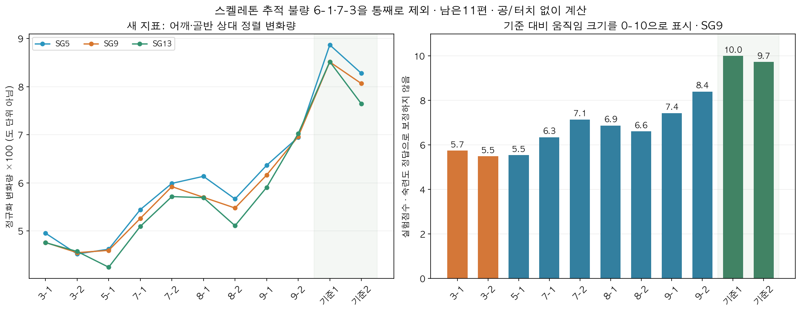

# Soccer Dribble Motion Analysis

**카메라 한 대로 촬영한 축구 드리블 영상에서 자세와 움직임을 비교하는 연구 프로젝트입니다.**

MediaPipe로 추출한 관절과 YOLO로 검출한 공을 이용해 **헤드업, 상체 각도, 어깨·골반 움직임**을 측정합니다. 현재는 인,인 드리블 13편을 검토하고, 다른 사람을 추적한 2편을 제외한 11편을 비교했습니다. 총점은 세 항목을 각각 **1/3**씩 반영합니다.

[전체 영상 결과](experiments/2026-09-20/README.md) · [계산식과 검증 범위](docs/current_evaluation.md) · [과거 실험 안내](docs/legacy_experiments.md)

## 무엇을 바꿨나

기존에는 어깨와 골반이 **각각 얼마나 크게 돌아갔는지**를 측정했습니다. 그런데 낮은 등급 영상에서도 큰 움직임이 나타나 기준 영상과 값이 겹쳤습니다. 움직임의 크기만으로는 드리블에 필요한 상체 사용을 충분히 설명하기 어려웠습니다.

그래서 **어깨선과 골반선의 관계가 동작 중 어떻게 바뀌는지**를 측정하도록 바꿨습니다. 화면에서 두 선이 나란해졌다가 서로 다른 방향으로 기울어지는 변화를 계산하고, 몸통 크기로 정규화합니다. 이 항목은 추정된 깊이값이나 공 검출 결과 없이 계산합니다.

| 항목 | 현재 측정 방법 | 입력 |
|---|---|---|
| 헤드업 | 공 방향 전환 후보 주변에서 머리 방향의 변화 폭을 평균 | 추정 3D 관절 + 발목 주변 공 검출 |
| 상체 각도 | 무릎–골반–어깨 각도의 좌우 평균을 영상 전체에서 평균 | 추정 3D 관절 |
| 어깨·골반 | 두 선의 상대 정렬이 변하는 폭 | 영상의 2D 관절 |

새 어깨·골반 지표에서 3점 영상은 0.045–0.048, 기준 영상은 0.081–0.085로 차이가 나타났습니다. 등급 영상 9편의 순위 상관은 **0.890**입니다. 같은 자료에서 여러 방법을 비교한 탐색 결과이며, 별도 영상에서 검증된 채점 정확도를 뜻하지 않습니다. 5점과 3점의 겹침, 7점과 8점의 역전도 남아 있습니다.



그림 왼쪽은 지표값을 100배로 표시한 값, 오른쪽은 기준 영상 대비 크기를 0–10으로 환산한 값입니다. 실제 3D 회전각이나 반응 속도가 아닙니다.

## 현재 실행 흐름

```text
원본 영상
  → extract_pose.py       관절 추출 및 스켈레톤 품질 검수
  → redetect_balls.py     매 프레임 발목 주변만 잘라 공 후보 검출
  → evaluate.py          세 지표 계산 → 각 1/3 총점 → JSON / Markdown 표
```

새 평가 경로는 SAM2를 사용하지 않습니다. `main.py`, `validate_scoring.py`, `scoring/score_mapper.py`와 기존 시각화 도구는 과거 XZ 회전 방식용입니다. 현재 결과를 얻으려면 **`evaluate.py`**를 사용하세요.

### 환경

수치 계산만 할 때는 Python 3.11과 아래 패키지면 됩니다. 테스트에는 영상이나 모델이 필요 없습니다.

```bash
python3.11 -m pip install -r requirements-evaluation.txt
python3.11 -m unittest discover -s tests -v
```

원본 영상부터 실행하려면 두 환경을 사용합니다. 실제 확인한 조합은 MediaPipe 추출: Python 3.9 / MediaPipe 0.10.21, 공 재검출: Python 3.11 / Ultralytics 8.4.22 / Torch 2.10.0입니다.

```bash
python3.9 -m pip install -r requirements.txt
python3.11 -m pip install -r requirements-detection.txt
```

- MediaPipe는 기존 `mp.solutions.pose` API를 사용합니다. 모델 복잡도 2의 `pose_landmark_heavy.tflite`를 설치된 MediaPipe의 `modules/pose_landmark/`에 준비해야 합니다. 추출기는 모델이 없으면 경로를 알려주고 종료합니다.
- 공 검출에는 **로컬 `yolo11s.pt`**가 필요합니다. [Ultralytics 공식 YOLO11 안내](https://docs.ultralytics.com/models/yolo11/)에서 가중치를 준비하고 `--model`로 지정하세요. 이 CLI는 가중치를 자동 다운로드하지 않습니다.
- 원본 영상, 관절 캐시, 모델 파일은 저장소에 포함하지 않습니다. 공개 결과표만으로 원본 측정을 재계산할 수는 없습니다.

### 1. 관절 추출

```bash
python3.9 extract_pose.py \
  --video-dir input/in_in \
  --cache-dir output/scoring_cache \
  --manifest experiments/2026-09-20/manifest.json
```

캐시가 이미 있으면 이 단계는 건너뜁니다. 새 영상에서는 올바른 사람의 어깨·골반을 따라가는지 원본 위에 좌표를 겹쳐 확인한 뒤 manifest를 작성해야 합니다. 추출 성공만으로 품질 검수가 끝난 것은 아닙니다. 제공 manifest는 현재 13편에 한정됩니다.

### 2. 발목 주변 공 재검출

```bash
python3.11 redetect_balls.py \
  --video-dir input/in_in \
  --cache-dir output/scoring_cache \
  --manifest experiments/2026-09-20/manifest.json \
  --model yolo11s.pt --device mps \
  --output-dir output/current/roi_candidates
```

MPS가 없으면 `--device cpu` 또는 사용 가능한 CUDA 장치를 지정합니다. 선수의 발목을 따라가는 영역을 사용하므로 화면 오른쪽으로 움직이는 공도 포함할 수 있습니다. 영역 안에 다른 공이 들어오는 경우는 후속 후보 선택과 검수에서 확인합니다.

### 3. 점수표 생성

```bash
python3.11 evaluate.py \
  --cache-dir output/scoring_cache \
  --candidates-dir output/current/roi_candidates \
  --output-dir output/current/evaluation
```

결과는 `results.json`, `scores.md`입니다. 기존 파일은 기본적으로 덮어쓰지 않으며, 교체하려면 해당 CLI에 `--overwrite`를 지정합니다. 계산 불가 항목이 하나라도 있으면 총점은 `N/A`입니다.

동일 원본·캐시로 공개된 실험값을 재현했는지 확인하려면 평가 명령에 아래 옵션을 추가합니다. 새 영상에는 적용하지 않습니다.

```bash
--verify-snapshot experiments/2026-09-20/results.json
```

## 검증한 범위

- 새 수치 계산 경로에서 **11편의 측정값·점수와 채택 이벤트 45개**를 기존 실험과 대조했습니다.
- 발목 주변 ROI는 **2,853프레임 전체**에서 기존 실험과 일치했습니다. 1편의 실제 공 재검출 및 관절 재추출도 기존 캐시와 대조했습니다.
- 어깨·골반은 깊이값 없이 계산하지만, 카메라 시점과 가림 영향은 남습니다. 공 방향 전환 후보도 실제 접촉 시점의 정답 라벨은 아닙니다.
- 지표 선택과 가중치 비교는 같은 소규모 자료에서 진행했습니다. 시간 구간에 따른 변동도 있어 별도 영상과 항목별 전문가 평가가 필요합니다.

## 파일 안내

| 경로 | 역할 |
|---|---|
| `extract_pose.py` | 기존 MediaPipe 추출기의 관절 전용 CLI |
| `redetect_balls.py`, `scoring/roi_ball.py` | 발목 ROI 공 후보 생성, 원본 좌표 복원 |
| `evaluate.py`, `scoring/current_metrics.py` | 현재 지표, 잠정 점수, 결과표 |
| `experiments/2026-09-20/` | 분석 대상, 고정 환산값, 공개 결과표·검증 요약 |
| `tests/` | 좌표·결측·점수·입출력 검증 |
| `analysis/`, `visualization/`, 기존 루트 실험 파일 | 과거 분석 및 시각화; [구분 안내](docs/legacy_experiments.md) 참고 |
