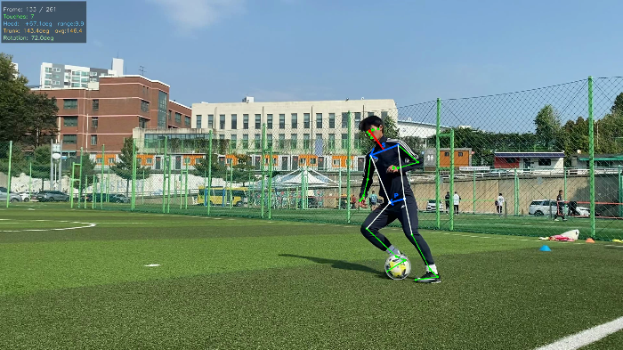
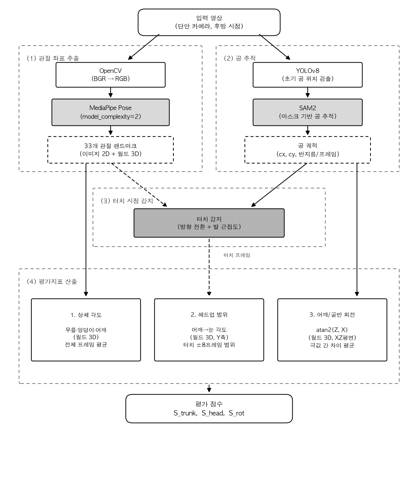
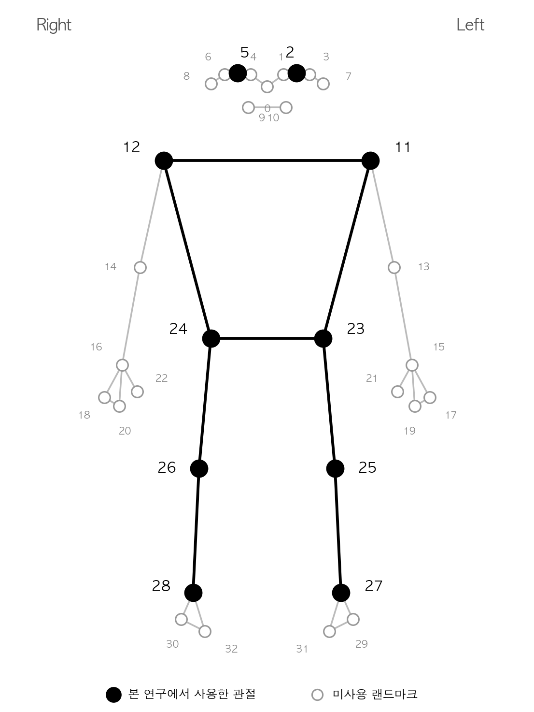
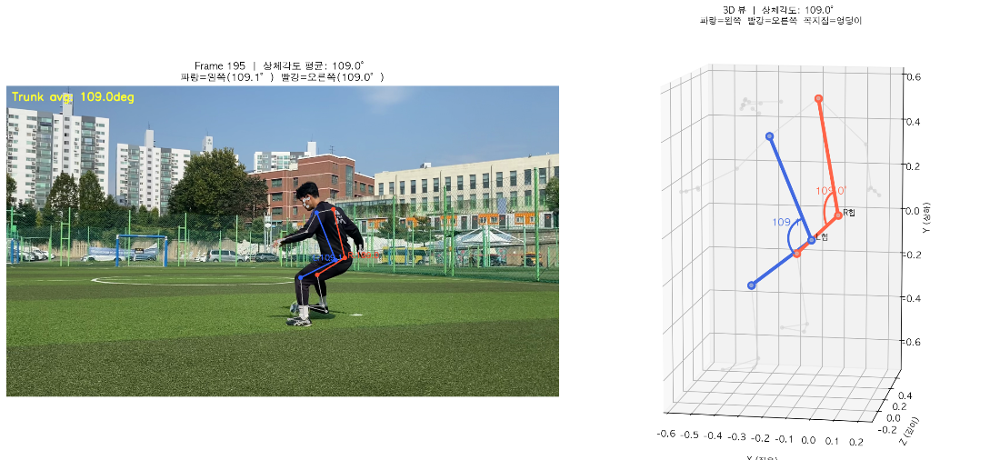
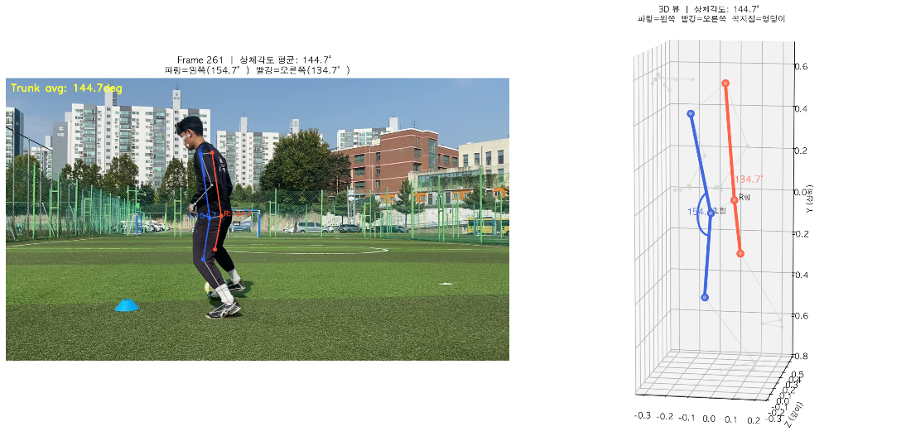
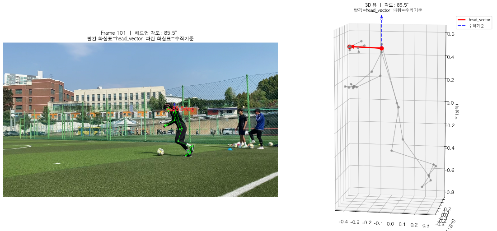
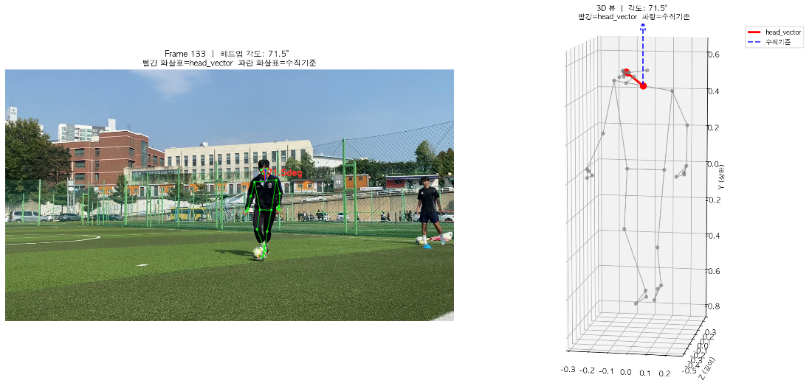
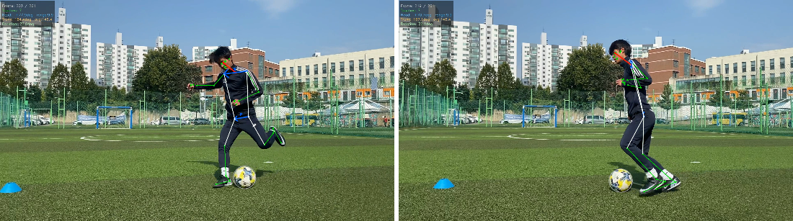
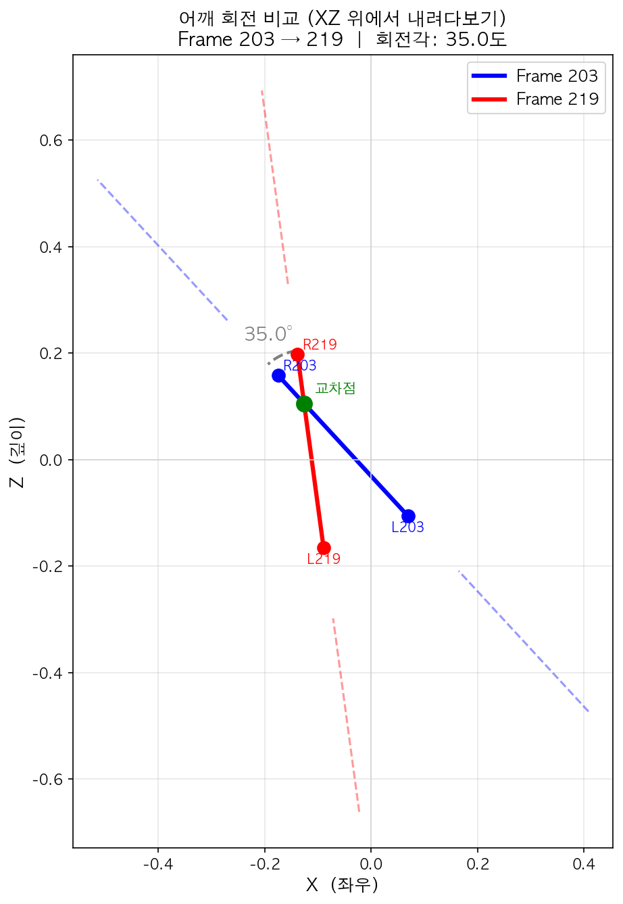

> **과거 방식 보관 문서.** 현재 어깨·골반 상대 정렬 지표와 1/3 총점은 [현재 계산법](current_evaluation.md)을 참고하세요. 아래 수식·주장은 당시 실험 설명이며 현재 적용 기준이 아닙니다.

<div align="center">

# ⚽ Soccer Dribble Motion Analysis

**단안 카메라 기반 축구 드리블 동작 정량 평가 시스템**

[](https://www.python.org/)
[](https://mediapipe.dev/)
[](https://github.com/facebookresearch/sam2)
[](https://github.com/ultralytics/ultralytics)

</div>

---

## 📖 목차

- [프로젝트 소개](#-프로젝트-소개)
- [시스템 아키텍처](#-시스템-아키텍처)
- [사용 관절 랜드마크](#-사용-관절-랜드마크)
- [평가 지표](#-평가-지표)
- [점수 산출](#-점수-산출)
- [신호 전처리](#-신호-전처리)
- [설치 및 실행 절차](#-설치-및-실행-절차)
- [프로젝트 구조](#-프로젝트-구조)
- [참고 문서](#-참고-문서)

---

## 🎯 프로젝트 소개

스마트폰 **1대**로 촬영한 드리블 영상만으로 선수의 **상체 각도**, **헤드업**, **어깨·골반 회전**을
자동 측정하고, 항목별 점수(0~10)와 총점을 산출하는 시스템입니다.

- 기존 드리블 평가는 코치의 **주관적 판단**에 의존
- 모션 캡처 장비는 **비용이 높고** 현장 적용이 어려움
- **카메라 1대 + AI**만으로 정량적 자세 평가 가능

| 스켈레톤 + 공 추적 오버레이 |
|:---:|
|  |

---

## 🏗 시스템 아키텍처



| 단계 | 모듈 | 역할 |
|:---:|:---|:---|
| (1) 관절 좌표 추출 | **MediaPipe Pose** (model_complexity=2) | 33개 관절의 이미지 2D + 월드 3D 좌표 |
| (2) 공 추적 | **YOLOv8** → **SAM2** | YOLO로 초기 공 검출 → SAM2 마스크 기반 전체 프레임 추적 |
| (3) 터치 시점 감지 | 방향 전환 + 발 근접도 | 공 X 궤적의 극값 + 발목-공 거리로 터치 프레임 판별 |
| (4) 평가지표 산출 | 상체 각도 · 헤드업 · 어깨/골반 회전 | 터치 프레임 기준으로 3개 지표 계산 → 점수화 |

---

## 🦴 사용 관절 랜드마크



본 연구에서 사용하는 MediaPipe Pose 랜드마크:

| 인덱스 | 관절 | 사용 지표 |
|:---:|:---|:---|
| 2, 5 | 왼눈 · 오른눈 | 헤드업 (어깨→눈 벡터) |
| 11, 12 | 왼어깨 · 오른어깨 | 헤드업, 상체 각도, **어깨 회전** |
| 23, 24 | 왼엉덩이 · 오른엉덩이 | 상체 각도(꼭짓점), **골반 회전** |
| 25, 26 | 왼무릎 · 오른무릎 | 상체 각도 |
| 27, 28 | 왼발목 · 오른발목 | 터치 감지 (공-발 근접도) |

---

## 📊 평가 지표

### 1. 상체 각도 (Trunk Angle)

> **무릎 – 엉덩이(꼭짓점) – 어깨**가 이루는 각도. 월드 3D 좌표 기준, 전체 프레임 평균.
> **상체를 많이 숙일수록(각도가 작을수록) 좋은 점수** — 낮은 자세는 방향 전환과 볼 컨트롤에 유리.

| 좋은 자세 (109.6°) | 나쁜 자세 (149.2°) |
|:---:|:---:|
|  |  |
| 무게중심이 낮아 민첩한 대응 가능 | 상체가 서 있어 반응이 느려짐 |

### 2. 헤드업 (Head-up)

> **어깨 중앙 → 눈 중앙 벡터**와 수직축(Y)의 각도. 월드 3D 좌표, **터치 ±8프레임** 범위에서 측정.
> **터치하는 순간에는 공을 보고, 터치 후에는 다시 고개를 들어야** 시야 확보와 볼 컨트롤을 모두 잡는다.

| 터치 직전 — 공 응시 (85.5°) | 터치 후 — 헤드업 (71.5°) |
|:---:|:---:|
|  |  |

각 터치 윈도우에서 각도 변화폭(max − min)을 측정하고, 전체 터치 평균으로 점수화합니다.
변화폭이 작을수록(머리가 안정적일수록) 높은 점수:

```
score = max(0, (30 − mean_range) / 30 × 10)
```

### 3. 어깨·골반 회전 (Shoulder / Pelvis Rotation)

> 어깨선(11→12)과 골반선(23→24) 벡터의 **XZ 평면 방향각** `atan2(z, x)`.
> **공이 가는 방향으로 어깨와 골반이 함께 회전**해야 하며, 회전 진폭이 클수록 상체를 적극 활용한 것.

| 터치 전 (203프레임) → 터치 후 (219프레임) |
|:---:|
|  |

위에서 내려다본 XZ 평면에서 어깨선의 회전:

| XZ 평면 어깨 회전 (35.0°) |
|:---:|
|  |

각 프레임의 방향각 시계열에서 **극값(봉우리·골짜기) 간 차이의 평균** = 회전 진폭 점수(°).
어깨와 골반을 **각각 독립적으로** 계산합니다.

---

## 🧮 점수 산출

영상 1편을 넣으면 **항목별 점수 3개 + 총점 = 총 4개의 점수**가 출력됩니다.

```
입력: input/in_in/영상.MOV
        │
        ▼
┌─────────────────────────────────────────┐
│  ① 상체 각도  → S_trunk  (0 ~ 10점)      │
│  ② 헤드업     → S_head   (0 ~ 10점)      │
│  ③ 어깨·골반  → S_rot    (0 ~ 10점)      │
├─────────────────────────────────────────┤
│  총점 = Σ (가중치 × 항목 점수)             │
└─────────────────────────────────────────┘
```

- 항목별 가중치는 [config.py](../config.py)의 `SKILL_EVALUATION['weights']`에서 조정
- 점수 매핑은 기준 영상(전문가 시연)과의 편차 기반: 기준값에 가까울수록 10점
- ⚠️ 상체 각도·회전의 0~10 매핑은 현재 고도화 진행 중 — 측정 각도(°)는 완전 동작

---

## 🔧 신호 전처리

MediaPipe 월드 랜드마크의 z축 노이즈로 인한 **스파이크(순간 튐)**와 선수 이동에 의한
**드리프트(저주파 흐름)**를 제거하기 위해 아래 파이프라인을 사용합니다:

```
atan2(z, x) → unwrap → Hampel 이상치 제거 → 선형 보간
→ Savitzky-Golay 평활(win=41) → 드리프트 제거(win=81 baseline 차감)
→ find_peaks → 극값 간 차이 평균 = 회전 진폭
```

**Hampel 판별식**: 전후 ±5프레임 윈도우의 **중앙값** 대비 10° 초과 시 이상치.

$$b_i = \mathbb{1}\left[\ \left|\,\theta_i - \mathrm{median}_{|j-i| \le 5}\, \theta_j\,\right| > 10°\ \right]$$

4가지 판별 방식(직전 프레임 / 최근 정상값 / 이동 평균 / Hampel)을 합성 신호와 실제 영상
13편으로 비교 검증하여 채택했습니다. 상세 근거: [docs/rotation_spike_filter_analysis.md](rotation_spike_filter_analysis.md)

---

## 🚀 설치 및 실행 절차

### 요구사항

| 항목 | 내용 |
|:---|:---|
| Python | **3.9** (MediaPipe 파이프라인) + **3.11** (SAM2 전용) |
| OS | macOS (Apple Silicon MPS 지원), Linux |
| 저장공간 | ~1GB (SAM2 체크포인트 포함) |

> MediaPipe와 SAM2의 요구 버전이 달라 **두 버전의 Python이 모두 필요**합니다.
> main.py(3.9)가 SAM2 추적만 3.11 서브프로세스로 호출합니다.

### 1. 저장소 클론

```bash
git clone https://github.com/jiwoo1105/soccer_motion_analysis.git
cd soccer_motion_analysis
```

### 2. 패키지 설치

```bash
# Python 3.9 — 메인 파이프라인
python3.9 -m pip install -r requirements.txt

# Python 3.11 — SAM2
python3.11 -m pip install sam2 torch
```

### 3. 모델 체크포인트 다운로드

```bash
# SAM2 체크포인트 (~180MB)
mkdir -p sam2_checkpoints
wget -O sam2_checkpoints/sam2.1_hiera_small.pt \
  https://dl.fbaipublicfiles.com/segment_anything_2/092824/sam2.1_hiera_small.pt

# YOLOv8 가중치는 첫 실행 시 자동 다운로드됩니다 (yolov8n.pt)
```

### 4. 분석할 영상 배치

```
input/
  └── in_in/
      └── 내영상.MOV        # 후방 시점, 인-인 드리블 촬영 영상
```

### 5. 실행

[main.py](../main.py) 상단의 `video_path`를 분석할 영상으로 수정한 뒤:

```bash
python3.9 main.py
```

### 6. 출력 확인

```
output/
  ├── videos/skeleton_output_<영상명>.mp4   # 스켈레톤 + 공 추적 + 터치 표시 영상
  ├── graphs/                               # 지표별 그래프 (헤드업·회전·상체각도)
  └── (콘솔) 항목별 측정값 + 점수            # S_trunk, S_head, S_rot, 총점
```

---

## 📁 프로젝트 구조

```
soccer_motion_analysis/
├── main.py                      # 전체 파이프라인 실행 (진입점)
├── config.py                    # 터치 감지·평가 가중치 등 모든 설정
├── requirements.txt
│
├── core/
│   ├── pose_extractor.py        # MediaPipe 포즈 추출
│   └── ball_detector.py         # YOLO 공 검출
├── sam2_ball_tracker.py         # SAM2 공 추적 (Python 3.11)
│
├── analysis/
│   ├── ball_motion_analyzer.py  # 공 궤적 분석 + 터치 감지
│   ├── head_pose_analyzer.py    # 헤드업 각도 + 점수
│   ├── trunk_pose_analyzer.py   # 상체 각도
│   └── dribble_cycle_analyzer.py# 드리블 사이클 분석
│
├── visualization/
│   ├── skeleton_drawer.py       # 스켈레톤/벡터 오버레이
│   ├── head_pose_plotter.py
│   ├── trunk_pose_plotter.py
│   ├── ball_motion_plotter.py
│   ├── dribble_cycle_plotter.py
│   └── pose_3d_plotter.py       # 3D 포즈 시각화
│
├── utils/math_utils.py
│
├── extract_rotation_score.py    # 어깨·골반 회전 점수 일괄 추출 (연구용)
├── compare_spike_methods.py     # 이상치 판별 4방식 비교 실험 (연구용)
├── visualize_trunk_angle.py     # README 상체각도 그림 생성
├── visualize_headup_angle.py    # README 헤드업 그림 생성
├── visualize_shoulder_rotation.py # README 회전 그림 생성
│
└── docs/
    ├── rotation_spike_filter_analysis.md   # 전처리 방법론 검증 (Hampel 채택 근거)
    ├── hampel_formula_latex.md             # 수식 정리
    └── images/                             # README 그림
```

---

## 📚 참고 문서

| 문서 | 내용 |
|:---|:---|
| [rotation_spike_filter_analysis.md](rotation_spike_filter_analysis.md) | 스파이크 판별 4방식 비교 검증, Hampel 채택 근거, 점수대 상관 분석 |
| [hampel_formula_latex.md](hampel_formula_latex.md) | 전처리 파이프라인 수식 정리 |
| [MediaPipe Pose](https://developers.google.com/mediapipe/solutions/vision/pose_landmarker) | 33개 랜드마크 정의 |
| [SAM2](https://github.com/facebookresearch/sam2) | 마스크 기반 비디오 객체 추적 |
| [Ultralytics YOLOv8](https://github.com/ultralytics/ultralytics) | 실시간 객체 검출 |
