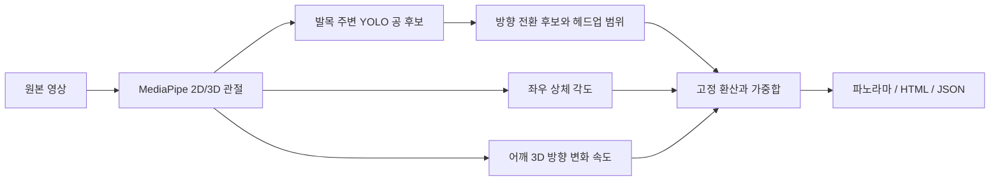

# 측정과 점수 환산

기본 프로필은 `configs/scoring.json`에 저장되어 있습니다. 입력 영상의 점수 라벨은 읽지 않으며, 새 영상을 추가해도 환산값을 다시 맞추지 않습니다. 아래 수치는 탐색 자료에서 고정한 비교 기준입니다.

## 처리 순서

## 1. 헤드업

눈 두 점의 중점에서 어깨 두 점의 중점을 뺀 벡터를 `h(t)`로 둡니다. 이 벡터와 수직 방향 `(0, −1, 0)` 사이의 각도를 `φ(t)`로 계산합니다. 필요한 관절은 양쪽 눈 2, 5와 양쪽 어깨 11, 12입니다.

$$
\phi(t)=\arccos\frac{h(t)\cdot(0,-1,0)}{\|h(t)\|},\qquad
H=\frac{1}{K}\sum_{k=1}^{K}\left[\max_{t\in[T_k-16,T_k+16]}\phi(t)-\min_{t\in[T_k-16,T_k+16]}\phi(t)\right]
$$

각도는 도 단위입니다. `T_k`는 검사를 통과한 공 방향 전환 **후보**의 원본 프레임 번호입니다. ±16은 앞 16장, 현재 1장, 뒤 16장으로 총 33장입니다. 약 30fps에서 양 끝 사이 시간은 약 1.07초입니다.

공 후보는 발목 주변 ROI에서 검출합니다. 후보의 크기와 형태, 발목 거리를 검사하고 짧은 결측만 보간합니다. X좌표를 SG11, 2차식으로 평활화한 뒤 간격 8프레임과 prominence 10px 조건으로 극값을 찾습니다. 후보 중심이 실제 검출 프레임인지, 발목과 200px 이내인지, 주변 공 좌표가 충분히 연속되는지 등을 검사합니다. 연속 결측 3프레임 이하이고 양 끝 사이 이동이 40px/프레임 이하일 때만 보간합니다. 후보 ±13에는 연속 공 좌표가 필요하며 ±8의 실제 관측 비율은 80% 이상이어야 합니다. 주변에서 80px를 넘는 관측 좌표 점프가 있으면 제외합니다. 기존 ±8 주변의 검출 품질 조건을 유지한 후 머리 각도 집계만 ±16으로 확장합니다. 따라서 공이 ±16 전체에서 관측된다고 보장하는 방식은 아닙니다.

머리 관절의 visibility가 모두 0.5 이상이고 각도가 유효한 33프레임 창이 2개 이상 있어야 `H`를 계산합니다. 각 창은 독립적인 영상 표본으로 취급하지 않습니다. 원본 터치 정답과 일치한다고 자동 확정하지도 않습니다.

현재 헤드업 점수는 다음과 같습니다.

$$
S_H=3+7\,\operatorname{clip}\left(\frac{H-10.225053625082124}{15.30499039887986-10.225053625082124},0,1\right)
$$

두 끝값은 기존 비교 자료 9편에서 얻은 최소/최대 각도 범위입니다. `3`과 `10`은 그 범위를 표시하는 눈금이며 실제 전문가 등급의 정답 경계가 아닙니다. 고개를 더 많이 움직였다고 기준보다 높다는 이유로 감점하지 않습니다. 상한보다 큰 값은 10점에서 제한하고 원시값 `H`도 남깁니다. 이는 머리 움직임의 폭이므로 실제 시선이나 고개를 든 방향 자체를 판별하지 않습니다.

## 2. 상체 각도

왼쪽은 무릎25–엉덩이23–어깨11, 오른쪽은 무릎26–엉덩이24–어깨12의 각도를 엉덩이를 꼭지점으로 구합니다. 필요한 여섯 관절의 좌표와 visibility가 유효하고 두 변의 길이가 0보다 큰 프레임만 사용합니다.

$$
\theta=\operatorname{mean}_{t\in\mathcal V}\left[\frac{\alpha_L(t)+\alpha_R(t)}{2}\right],\qquad
S_T=10\,\operatorname{clip}\left(\frac{180-\theta}{36.4628217436476},0,1\right)
$$

`α_L`, `α_R`은 각 측면의 3D 각도이고 `𝒱`는 양쪽 모두 유효한 프레임 집합입니다. 기준 보각 36.4628217436476°는 기존 기준 영상 두 편의 평균에서 고정했습니다. 각도 자체 `θ`와 환산값을 구분해 저장합니다. 한쪽만 남은 프레임으로 임의 대체하지 않습니다.

이 값은 고관절 굽힘을 포함한 관절 각도입니다. 몸통의 지면 기준 기울기와 동일하지 않으며, 무릎이나 다리의 위치 변화가 영향을 줍니다.

## 3. 어깨 방향 변화 속도

어깨선 방향이 연속 프레임 사이에서 얼마나 빨리 달라지는지 계산합니다. 골반 좌표나 공 터치는 사용하지 않습니다.

1. 오른쪽 어깨12에서 왼쪽 어깨11을 빼고 길이를 1로 맞춰 단위 방향 `u(t)`를 만듭니다.
2. 연속 유효 구간 안에서 X, Y, Z 각각에 SG13, 2차식 필터를 적용합니다. 필터 결과를 다시 길이 1로 맞춘 방향을 `û(t)`로 둡니다.
3. 원본에서 바로 이웃한 두 유효 프레임의 방향각 차이 `δ(t)`를 계산하고 FPS `f`를 곱합니다.
4. 계산 가능한 이웃 프레임 쌍 집합 `𝒫`에서 속도를 평균합니다.

$$
\delta(t)=\frac{180}{\pi}\operatorname{atan2}\left(\|\hat u(t-1)\times\hat u(t)\|,\hat u(t-1)\cdot\hat u(t)\right)
$$

$$
V=\frac{1}{|\mathcal P|}\sum_{t\in\mathcal P}\delta(t)f,\qquad
S_S=10\,\operatorname{clip}\left(\frac{V}{93.9849170623855},0,1\right)
$$

`δ`는 도, `V`는 도/초입니다. 예를 들어 30fps에서 두 이웃 방향이 3° 차이 나면 그 프레임 쌍의 속도는 90°/초입니다. 매 유효 프레임 쌍에서 반복한 후 평균하므로, 한 번 크게 돈 각도나 왕복 한 주기의 폭을 뜻하지 않습니다. 93.9849170623855°/s는 기존 기준 두 영상에서 고정한 평균 속도입니다.

### 어깨 품질 조건

- 좌표가 유한하고 양쪽 visibility ≥ 0.5이며 이미지 관절이 화면 안에 있어야 합니다.
- 어깨선 길이가 1e−5보다 크고 XZ 투영 길이가 전체 길이의 0.05배보다 커야 합니다.
- 바로 이웃한 원시 방향의 차이가 45°를 넘거나 두 어깨 길이 중 큰 값/작은 값의 비율이 1.5를 넘으면 두 끝 프레임을 제외합니다.
- SG9, SG13, SG21에서 평활화 벡터 길이가 모두 0.2를 넘는 공통 구간을 집계합니다. SG13을 실제 속도 계산에 사용합니다.
- 연속 구간은 최소 24프레임이어야 하며 양 끝 11프레임은 집계하지 않습니다. 결측 앞뒤를 이어서 각속도를 계산하지 않습니다.

갑작스러운 관절 튐 일부를 걸러내는 수치 조건입니다. 서서히 잘못 따라가는 추적, 다른 사람의 관절, 실제 빠른 동작과 추정 오류를 완전히 구분하는 판별기는 아닙니다. 그림의 여섯 장만으로 영상 전체 추적이 검증되는 것도 아닙니다.

## 4. 총점과 결측

$$
S=0.10S_H+0.80S_T+0.10S_S
$$

합산에는 반올림 전 값을 사용합니다. 입력으로 지정한 가중치를 기록하며 합이 1이 아니면 오류를 냅니다. 하나라도 계산 불가이면 총점은 N/A입니다. 계산 가능한 최소 표본 수는 헤드업 이벤트 2개, 상체 양쪽 유효 프레임 1개, 어깨 유효 이웃 쌍 1개입니다. 이 최소값은 계산 가능 조건이며 촬영 품질의 충분조건으로 검증한 기준은 아닙니다. 현재 가중치는 운영 비교안이며 새 영상의 등급을 잘 예측한다고 확정한 값은 아닙니다.

라이브러리의 `measure_video(..., excluded_frames=...)`에는 원본에서 직접 확인한 실패 프레임을 전달할 수 있습니다. 해당 마스크는 세 항목에 모두 적용됩니다. CLI는 과거 영상의 이름별 검수 마스크를 자동 적용하지 않습니다. 따라서 새로 추론한 결과는 수동 검수가 포함된 과거 표와 다를 수 있습니다.

## 5. 원본 시계와 재현 범위

관절이 없는 프레임도 배열에 남기고 NaN으로 표시합니다. 원본 프레임 번호는 0부터 시작하며 표시 시간은 프레임 번호/영상 평균 FPS입니다. VFR 영상의 개별 디코더 PTS를 사용한 속도 계산은 구현하지 않았습니다. 정밀 비교에는 같은 고정 FPS 촬영 조건을 사용해야 합니다.

MediaPipe 자체의 `smooth_landmarks=True`를 사용하고, 어깨 단위 방향에는 추가 SG 평활화를 적용합니다. 실행 환경과 모델 파일 해시를 저장하지만 GPU, 디코더, 운영체제가 바뀐 경우 비트 단위 일치까지 보장하지 않습니다. 이미지의 고관절 선과 머리 화살표는 화면상의 안내 표시이며, 계산된 3D 각도를 2D 사진 각도로 대체하지 않습니다.
