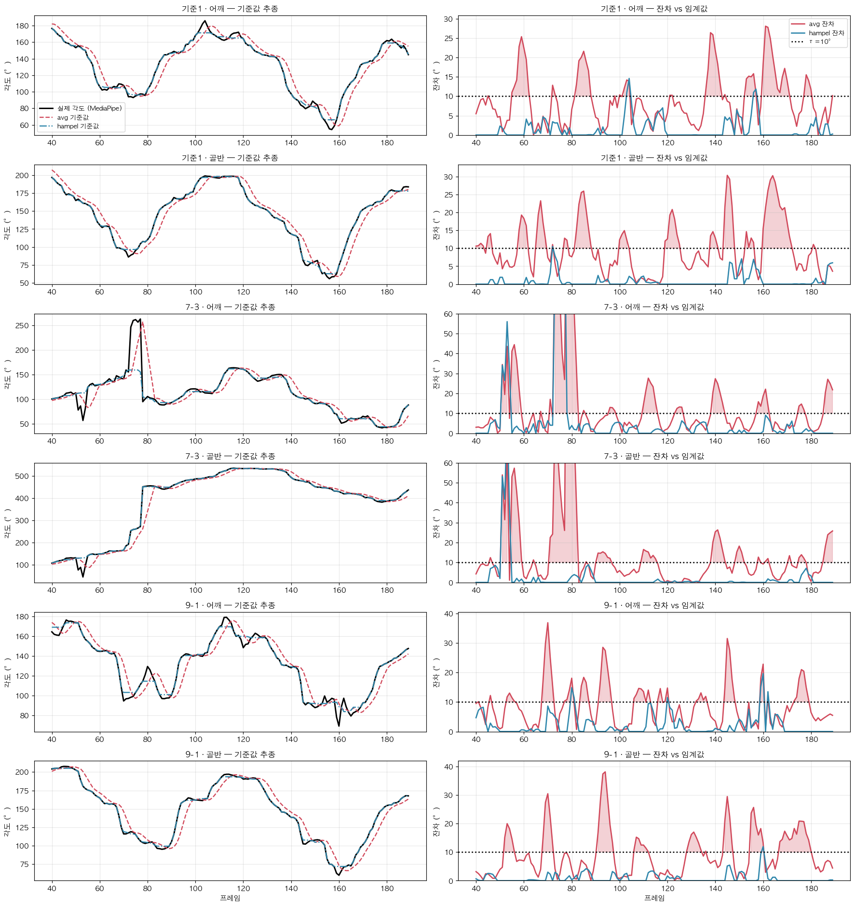

> **과거 방식 보관 문서.** 현재 어깨·골반 상대 정렬 지표와 1/3 총점은 [현재 계산법](current_evaluation.md)을 참고하세요. 아래 수식·주장은 당시 실험 설명이며 현재 적용 기준이 아닙니다.

# 어깨·골반 회전 각도 이상치(스파이크) 판별 방식 비교 분석

> 대상 스크립트: `compare_spike_methods.py`
> 대상 영상: `input/in_in/` 13개 (인,인 3-1 ~ 9-2, 기준1·2)
> 지표: 어깨/골반 회전 진폭 점수 `S_rot` (극값 간 차이의 평균, 단위 °)

---

## 1. 문제 정의

MediaPipe world landmark로부터 어깨 벡터(11→12), 골반 벡터(23→24)를 뽑아
`atan2(vz, vx)`로 회전각을 구하면, **랜드마크 추정 실패로 인한 순간 점프(스파이크)** 가 섞인다.

- 단발성 스파이크: 한 프레임만 수십 도 튐
- **지속형 스파이크**: 좌우 랜드마크가 뒤바뀌거나 z 추정이 무너져 여러 프레임 동안 지속

이 스파이크를 그대로 두면 `find_peaks`가 가짜 극값을 잡아 점수가 부풀려진다.
따라서 **"어느 프레임이 이상치인가"를 판별하는 기준**이 점수의 신뢰도를 결정한다.

### 공통 파이프라인

판별 기준을 제외한 나머지는 4가지 방식이 완전히 동일하다.

```
atan2(vz, vx)
  → unwrap                     (±180° 경계 점프 제거)
  → 이상치 판별 (← 여기만 다름)
  → 선형 보간                   (양측 최근접 정상 프레임 사이)
  → Savitzky-Golay 평활 (win=41, order=2)
  → 드리프트 제거 (win=81 baseline 차감)
  → find_peaks (distance=10, prominence=3)
  → 연속 극값 차의 평균 = S_rot
```

**공통 임계값 τ = 10°.** 즉 "기준값과 10° 이상 벌어지면 이상치".
차이는 오직 **기준값을 무엇으로 잡느냐** 하나뿐이다.

---

## 2. 비교한 4가지 판별 방식

| 방식 | 비교 기준 | 수식 | 특징 |
|---|---|---|---|
| ① old (기존) | 직전 프레임 t−1 | `\|θᵢ − θᵢ₋₁\| > τ` | 스파이크 직후 정상 프레임 오판, 지속형 스파이크 놓침 |
| ② lastvalid | 가장 최근 "정상" 프레임 | `\|θᵢ − θ_lastvalid\| > τ` | 스파이크 후 실제 회전이 진행되면 기준이 동결되어 정상 프레임 대량 오판 |
| ③ avg | 이전 5프레임의 **평균** | `\|θᵢ − mean(θᵢ₋₅..ᵢ₋₁)\| > τ` | 기준이 과거값이라 항상 지연됨 → 빠른 회전 구간에서 정상 프레임 오판 |
| ④ **Hampel (채택)** | 전후 ±5프레임 윈도우의 **중앙값** | `\|θᵢ − median(θᵢ₋₅..ᵢ₊₅)\| > τ` | 기준이 움직임을 따라가고(지연 없음), 중앙값이라 스파이크에 오염 안 됨 |

기준값 설계에는 **직교하는 두 축**이 있다.

| | 과거만 사용 (단측) | 전후 사용 (중심) |
|---|---|---|
| **평균 계열** (오염됨) | ② lastvalid, ③ avg | — |
| **중앙값 계열** (강건) | — | ④ **Hampel** |

①은 윈도우 크기 1의 특수 케이스다. Hampel은 두 축 모두에서 반대편 선택을 한 것뿐이다.

---

## 3. 검증 방법 ① — 정답을 아는 합성 신호

> **이 절은 합성 데이터다.** 실제 영상 검증은 §4-③ 및 §5 참조.

실제 영상은 참값이 없어서 **"어느 점수가 맞는지" 증명할 수 없다.**
그래서 참 진폭을 아는 합성 신호를 만들어 각 방식의 **검출 성능(TP/FN/FP)** 을 직접 측정했다.

| 항목 | 값 |
|---|---|
| 참 신호 | `15·sin(2πt/20)` — 진폭 p2p 30°, 주기 20프레임(0.67s @30fps) |
| 드리프트 | `0.05·t` (전진 이동에 의한 저주파 성분) |
| 노이즈 | `N(0, 2°)` (MediaPipe 랜드마크 지터) |
| 전체 길이 | 300 프레임 |
| 단발성 스파이크 | 5개 (+55°, 각 1프레임) |
| **지속형 스파이크** | 2개 (+45°, 각 4·5프레임) |
| **참 이상치 총계** | **14 프레임** |

최대 각속도 = 15 × 2π/20 = **4.71 °/frame = 141 °/s**

### 검증 결과

| 방식 | 점수 | 참값 오차 | 플래그 | TP | **FN (놓침)** | **FP (오탐)** |
|---|---|---|---|---|---|---|
| **정답** | **6.7** | — | — | — | — | — |
| ① old | 8.6 | **+1.9** | 20 | 7 | **7** | 13 |
| ② lastvalid | 7.0 | +0.3 | 64 | 14 | 0 | **50** |
| ③ avg | 7.1 | +0.4 | **145** | 13 | 1 | **132** |
| ④ **Hampel** | **6.5** | **−0.2** | 20 | **14** | **0** | **6** |

- 참 이상치는 **14개**인데 avg는 **145개(전체의 48%)** 를 이상치로 판정했다.
- Hampel만 **재현율 100%(FN=0) + 낮은 오탐(FP=6)** 을 동시에 달성했다.
- old는 참 이상치의 **절반(7/14)을 놓쳤고**, 참값 오차도 +1.9로 가장 컸다.

> **주의**: avg의 점수 오차(+0.4)가 작게 나온 것은 방어 근거가 못 된다.
> 300프레임 중 132개를 잘못 지우고 보간으로 채운 뒤 **우연히** 맞은 것이다.
> 실제 영상에서 avg가 양방향으로 튀는 것이 그 증거다 (§5 참조).

---

## 4. 각 방식이 실패하는 이유 (상세)

### ① old — 직전 프레임 기준

**판별식**: `|θᵢ − θᵢ₋₁| > 10°`

이는 곧 **각속도 임계**다. 30fps에서 10°/frame = **300°/s**.
실제 드리블 상체 회전은 100~150°/s 수준이라 여기 못 미친다.
→ **정상 움직임은 거의 걸리지 않는다.** old의 점수가 멀쩡해 보이는 이유가 이것이다.

문제는 두 가지 실패 모드다.

**(a) 스파이크 직후 정상 프레임 오판**

스파이크 하나가 **큰 차분 2개**를 만든다.

```
프레임:   ... 10   11   12   13 ...
각도:     ... 20°  20°  75°  21° ...     ← 12번이 스파이크
차분:          0   +55  −54
판정:          정상  이상  이상            ← 13번은 정상인데 플래그
```

진입 차분(11→12)과 복귀 차분(12→13)이 모두 τ를 넘어 **정상 프레임 13번까지 삭제**된다.
시뮬레이션에서 FP 13개가 정확히 이 현상이다.

**(b) 지속형 스파이크 놓침 — 더 치명적**

```
프레임:   ... 118  119  120  121  122  123  124 ...
각도:     ... 20°  20°  65°  66°  64°  65°  21° ...   ← 120~123이 오염
차분:          0    +45  +1   −2   +1   −44
판정:          정상  이상  정상  정상  정상  이상        ← 내부 3프레임 통과
```

진입·복귀 프레임만 걸리고 **오염된 평지 내부는 차분이 작아 통과**한다.
그 결과 보간은 양 끝만 손보고 **45° 오염된 평지가 그대로 살아남는다.**
이 평지는 `find_peaks`에게 거대한 가짜 극값으로 보여 **점수를 부풀린다.**

시뮬레이션의 FN 7개, 참값 오차 **+1.9°** 가 전부 이 현상이다.

---

### ② lastvalid — 마지막 정상 프레임 기준 (기각)

**판별식**: `|θᵢ − θ_lastvalid| > 10°`, 정상 판정 시에만 `θ_lastvalid` 갱신

이 방식의 치명적 결함은 **기준값이 자기 판정 결과에 의존하는 피드백 루프**라는 점이다.

```
1. 프레임 k가 거부됨          → 기준값 동결
2. 실제 회전이 계속 진행       → k+1도 기준값에서 10° 이상 벗어남
3. k+1도 거부됨               → 기준값 여전히 동결
4. 회전이 진행될수록 격차 확대  → 이후 전부 거부
```

**자기강화 루프(latch)**다. 신호가 우연히 동결된 기준값의 10° 이내로 되돌아오기 전까지
회복이 불가능하고, 드리프트가 있으면 **영원히 회복 못 한다.**

실측 결과가 정확히 이를 보여준다.

| 영상 | 부위 | old | **lastvalid** | 플래그 (old → lastvalid) |
|---|---|---|---|---|
| 9-1 | 어깨 | 22.0° | **12.1°** | 18 → **117** |
| 9-1 | 골반 | 33.3° | **14.6°** | 20 → **121** |
| 9-2 | 어깨 | 16.8° | 16.3° | 7 → **72** |
| 9-2 | 골반 | 22.6° | **15.2°** | 11 → **158** |
| 기준1 | 어깨 | 26.4° | **15.7°** | 8 → **146** |
| 기준1 | 골반 | 29.3° | **10.6°** | 15 → **212** |
| 기준2 | 어깨 | 22.7° | **9.6°** | 9 → **184** |
| 기준2 | 골반 | 31.9° | **8.9°** | 15 → **191** |

**기준2 골반은 31.9° → 8.9° (−72%)** 로 붕괴했다. 플래그 191개.
점수가 낮아진 게 아니라, 신호 전체가 보간 직선으로 대체되어 **더 이상 측정이 아니게 된 것**이다.

> **대조**: old와 Hampel은 **상태가 없다**. 매 프레임을 원본 데이터에서 독립적으로 판정하므로
> 이런 폭주가 원천적으로 불가능하다. 판별기에 상태를 넣으면 안 된다는 교훈.

---

### ③ avg — 이전 5프레임 평균 기준 ⭐ 핵심

**판별식**: `|θᵢ − mean(θᵢ₋₅ .. θᵢ₋₁)| > 10°`

avg는 **세 가지 실수를 동시에** 저지른다.

#### (a) 지연 편향 — 정상 움직임이 구조적으로 걸린다 【실제 영상 검증】

`mean(θᵢ₋₅..θᵢ₋₁)`의 무게중심은 **t−3**이다. 즉 기준값이 항상 3프레임 과거다.

각속도 ω로 회전 중이라면, **노이즈도 이상치도 전혀 없는 신호**에서조차

```
잔차 = θᵢ − 기준값 ≈ 3ω
```

임계값 10°를 대입하면:

> **ω > 3.33 °/frame = 100 °/s 이면 이상치로 판정된다.**

**이 공식이 실제 영상에서 성립하는지 직접 검증했다** (기준1·7-3·9-1, 총 1298프레임):

| 항목 | 값 |
|---|---|
| `avg 잔차 / (3 × 각속도)` 의 중앙값 | **0.99** |
| `avg 잔차` 와 `3 × 각속도` 의 상관계수 | +0.50 |

**공식이 실측으로 확인된다.** 그리고 각속도만으로 예측한 오탐률이 실제와 거의 일치한다:

| 영상 | 부위 | 각속도 중앙 | 각속도 90% | **3ω>10 예측** | **실제 avg 오탐** | hmp 오탐 |
|---|---|---|---|---|---|---|
| 기준1 | 어깨 | 2.42 °/f | 6.82 °/f | 37.4% | **33.3%** | 1.8% |
| 기준1 | 골반 | 2.11 | 7.63 | 36.5% | **37.4%** | 0.5% |
| 7-3 | 어깨 | 1.96 | 8.11 | 31.2% | **28.0%** | 5.3% |
| 7-3 | 골반 | 2.20 | 8.06 | 34.9% | **37.0%** | 2.1% |
| 9-1 | 어깨 | 2.97 | 7.21 | 44.8% | **37.8%** | 7.1% |
| 9-1 | 골반 | 2.23 | 7.34 | 37.3% | **39.8%** | 3.3% |

실제 드리블의 각속도는 **중앙값 ~2.2 °/frame, 상위 10%는 7.5 °/frame 이상**이다.
임계 3.33 °/frame을 넘는 프레임이 전체의 **31~45%** 이고, avg는 정확히 그만큼을 오탐한다.

> **주의**: 실제 신호는 매끄러운 사인파가 아니라 **가파른 경사와 평지가 반복**되는 형태다
> (p2p 76~186°, 지배주기 71~112프레임). 평지 구간에서는 잔차가 0에 가깝고,
> **급경사 구간에서만 20~30°로 치솟는다.** 그래서 "주기가 짧아서"가 아니라
> **"경사가 가파른 구간이 전체의 3~4할이라서"** 오탐이 그만큼 나온다.

#### (b) 하필 그 프레임들이 신호 그 자체다 【실제 영상 검증】

`peak_to_peak_score`는 극값과 그 **사이의 전환 구간**을 측정한다.
그 구간이 바로 각속도가 최대인 구간이다.
avg는 **점수를 만드는 바로 그 프레임들을 지우고 직선으로 채운다.**

실제 영상 1298프레임 실측:

```
avg 오탐 프레임의 평균 |각속도|    = 5.92 °/frame
avg 정상판정 프레임의 평균 |각속도| = 2.40 °/frame     → 2.5배 차이
```

오탐이 빠른 프레임에 **체계적으로 집중**되어 있다. 무작위 오류가 아니다.

대조적으로 Hampel이 걸러낸 프레임의 평균 각속도는 **11.40 °/frame**(= 진짜 스파이크),
Hampel 잔차와 각속도의 상관은 **+0.27로 낮다** — 즉 **속도에 휘둘리지 않고 진짜 이상치만** 잡는다.



위 그림에서 확인되는 것:
- **왼쪽 열**: 파란 선(Hampel 기준)은 검은 선(실제 각도)과 거의 겹친다. 빨간 선(avg 기준)은 항상 뒤처진다.
- **7-3 어깨 (3번째 줄)**: 프레임 72~78의 진짜 스파이크(260°까지 튐)에서
  **Hampel 기준은 160°에 머물며 따라가지 않고**, avg 기준은 같이 끌려 올라간다 → (c)의 오염 실례.
- **오른쪽 열**: 평지 구간에서 avg 잔차가 바닥에 붙었다가 급경사에서만 임계선을 넘는 패턴.
- **Hampel 잔차의 중앙값은 0.0°** — 단조 구간에서 중앙값 = 정중앙 값이므로 정확히 일치한다.

#### (c) 평균은 붕괴점(breakdown point) = 0

이상치 제거의 대전제는 **"기준값이 이상치에 오염되지 않을 것"** 이다.
그런데 평균은 표본 하나로 무너진다.

| 추정량 | 붕괴점 | 5프레임 창에 +55° 스파이크 1개가 들어왔을 때 |
|---|---|---|
| 평균 (avg) | **0%** | 기준값이 **11° 이동** (55/5) |
| 중앙값 (Hampel, 11프레임) | **50%** | 기준값 **변화 없음** |

결과:
- 스파이크 뒤 5프레임이 오염된 기준값 때문에 **줄줄이 오탐**
- 지속형 스파이크는 평균을 자기 쪽으로 끌어당겨 **스스로를 숨긴다** (자기 은폐)

#### (d) 단측(과거) 윈도우를 쓸 이유가 없다

trailing window는 **실시간 처리용** 설계다.
이 파이프라인은 영상 파일 전체를 읽는 **오프라인 분석**이라 미래 프레임이 이미 손에 있다.
과거만 쓰면 정보의 절반을 버리고 (a)의 지연을 대가로 지불하는 셈이다.

#### 요약

| 축 | avg의 선택 | 결과 (실제 영상 실측) |
|---|---|---|
| 윈도우 위치 | 과거만 (t−5..t−1) | 3프레임 지연 → **정상 프레임의 28~40% 오탐** |
| 통계량 | 평균 | 붕괴점 0 → 스파이크 1개로 기준 오염 |
| 정보 활용 | 절반 폐기 | 오프라인인데 실시간 제약을 스스로 부과 |

**Hampel은 이 세 가지를 전부 뒤집은 것뿐이다.**

---

### ④ Hampel — 전후 ±5프레임 중앙값 (채택)

**판별식**: `|θᵢ − median(θᵢ₋₅ .. θᵢ₊₅)| > 10°`

**(a) 지연 편향 = 0**

단조 증가하는 구간에서 대칭 윈도우의 중앙값은 **정중앙 원소와 정확히 같다.**
따라서 등속 회전에서 잔차가 **정확히 0**이다. 아무리 빠르게 회전해도 오탐이 없다.

```
avg    : 등속 회전 시 잔차 = 3ω        → ω가 크면 오탐
Hampel : 등속 회전 시 잔차 = 0         → 속도 무관
```

곡률이 있는 극값 부근에서도 잔차는 `≈ ½·|θ''|·h²` 로 억제된다.

**(b) 붕괴점 50%**

11개 표본 중 **5개까지 임의로 오염되어도 중앙값은 움직이지 않는다.**
→ 지속형 스파이크(4~5프레임)도 나머지 6~7개 정상 표본에 의해 **투표로 기각**된다.
→ old가 놓쳤던 오염 평지의 **내부 프레임까지 전부 검출** (시뮬 FN=0).

**(c) 상태 없음 (stateless)**

매 프레임을 원본 데이터에서 독립 계산한다.
lastvalid 같은 피드백 폭주가 구조적으로 불가능하다.

**(d) 교수님 원안의 강건한 버전**

"이전 N프레임과 비교"라는 원안의 **의도(국소 문맥과 비교)는 그대로 유지**하면서,
평균 → 중앙값, 단측 → 중심으로 바꾼 것이다. 개념적 연속성이 있다.

**(e) 실제 영상 실측**

| 지표 | avg | **Hampel** |
|---|---|---|
| 오탐률 (정상 프레임 대비) | 28 ~ 40% | **0.5 ~ 7.1%** |
| 잔차 중앙값 | 5.7 ~ 8.1° | **0.0 ~ 0.5°** |
| 잔차와 각속도의 상관 | +0.50 (속도에 휘둘림) | **+0.27 (무관)** |
| 걸러낸 프레임의 평균 각속도 | 5.92 °/f (= 정상 회전) | **11.40 °/f (= 진짜 스파이크)** |

> **한계도 명시할 것**: Hampel 잔차가 항상 0은 아니다. **등속 구간에서만 정확히 0**이고,
> 극값 근처에서는 곡률 때문에 잔차가 남는다. 합성 사인파 검증 기준
> p2p 40°에서 8.2°, p2p 45°를 넘으면 극값에서도 오탐이 시작된다.
> 즉 **"오차가 없다"가 아니라 "현재 데이터 범위에서 임계값 안에 들어온다"** 가 정확한 서술이다.

---

## 5. 실제 영상 결과 — 점수대별

파일명 앞자리(`3-1`, `7-2` 등)가 **평가 점수대**다. 점수대 오름차순 정렬.

### 5-1. 회전 진폭 점수 `S_rot` (°)

| 점수대 | 영상 | 어깨 old | 어깨 avg | 어깨 hmp | 골반 old | 골반 avg | 골반 hmp |
|---|---|---|---|---|---|---|---|
| 3 | 인,인 3-1 | 25.7 | 25.4 | 26.2 | 26.8 | **35.0** | 21.7 |
| 3 | 인,인 3-2 | 19.8 | 19.2 | 19.7 | 19.6 | 20.0 | 19.6 |
| 5 | 인,인 5-1 | 9.4 | 10.3 | 9.4 | 11.1 | 11.1 | 11.1 |
| 6 | 인,인 6-1 | 16.2 | 16.1 | 16.3 | 23.1 | 22.6 | 23.1 |
| 7 | 인,인 7-1 | 22.8 | **17.5** | 22.7 | 30.3 | **24.2** | 30.3 |
| 7 | 인,인 7-2 | 20.4 | 20.3 | 21.3 | 29.1 | 27.7 | 28.8 |
| 7 | 인,인 7-3 | **31.9** | **16.5** | **21.1** | 35.1 | 32.2 | 35.2 |
| 8 | 인,인 8-1 | 15.4 | 14.7 | 15.1 | 20.4 | 18.2 | 20.3 |
| 8 | 인,인 8-2 | 11.1 | 11.2 | 11.1 | 17.0 | **19.1** | 17.0 |
| 9 | 인,인 9-1 | 22.0 | 23.0 | 22.4 | 33.3 | 32.8 | 33.6 |
| 9 | 인,인 9-2 | 16.8 | 16.1 | 16.6 | 22.6 | 22.0 | 22.5 |
| 기준 | 인,인 기준1 | 26.4 | 25.4 | 26.2 | 29.3 | 28.8 | 29.3 |
| 기준 | 인,인 기준2 | 22.7 | 21.8 | 22.4 | 31.9 | 30.2 | 31.5 |

### 5-2. 이상치 플래그 프레임 수

| 점수대 | 영상 | 어깨 old | 어깨 avg | 어깨 hmp | 골반 old | 골반 avg | 골반 hmp |
|---|---|---|---|---|---|---|---|
| 3 | 인,인 3-1 | 8 | **78** | 6 | 15 | **101** | 9 |
| 3 | 인,인 3-2 | 7 | **46** | 7 | 11 | **80** | 11 |
| 5 | 인,인 5-1 | 0 | **49** | 0 | 1 | **29** | 0 |
| 6 | 인,인 6-1 | 4 | **22** | 0 | 3 | **46** | 0 |
| 7 | 인,인 7-1 | 2 | **60** | 4 | 2 | **65** | 0 |
| 7 | 인,인 7-2 | 14 | **107** | 16 | 18 | **95** | 8 |
| 7 | 인,인 7-3 | 16 | **56** | 11 | 14 | **73** | 6 |
| 8 | 인,인 8-1 | 4 | **63** | 3 | 10 | **75** | 4 |
| 8 | 인,인 8-2 | 9 | **73** | 0 | 13 | **90** | 4 |
| 9 | 인,인 9-1 | 18 | **106** | 24 | 20 | **114** | 18 |
| 9 | 인,인 9-2 | 7 | **64** | 4 | 11 | **85** | 1 |
| 기준 | 인,인 기준1 | 8 | **78** | 7 | 15 | **87** | 3 |
| 기준 | 인,인 기준2 | 9 | **83** | 4 | 15 | **95** | 4 |
| | **평균** | **8.2** | **68.1** | **6.6** | **11.4** | **79.6** | **5.2** |

**avg는 old의 7~8배, Hampel의 10~15배를 이상치로 판정한다.** 영상당 46~114 프레임.
이 규모면 신호의 상당 부분이 보간으로 생성된 값이며, **측정이 아니라 합성**이다.

### 5-2b. Hampel 기준 상세 (전 영상, 점수대순)

| 점수대 | 영상 | 프레임 | 어깨 점수 | 골반 점수 | X-factor | 어깨 플래그 | 골반 플래그 | 어깨 각속도90% |
|---|---|---|---|---|---|---|---|---|
| 3 | 3-1 | 240 | 26.2 | 21.7 | −4.4 | 6 (2.5%) | 9 (3.8%) | 6.54 °/f |
| 3 | 3-2 | 219 | 19.7 | 19.6 | −0.1 | 7 (3.2%) | 11 (5.0%) | 5.55 |
| 5 | 5-1 | 232 | 9.4 | 11.1 | +1.7 | 0 (0.0%) | 0 (0.0%) | 4.68 |
| 6 | 6-1 | 340 | 16.3 | 23.1 | +6.9 | 0 (0.0%) | 0 (0.0%) | 3.48 |
| 7 | 7-1 | 267 | 22.7 | 30.3 | +7.7 | 4 (1.5%) | 0 (0.0%) | 5.69 |
| 7 | 7-2 | 292 | 21.3 | 28.8 | +7.5 | 16 (5.5%) | 8 (2.7%) | 7.08 |
| 7 | 7-3 | 209 | 21.1 | 35.2 | +14.1 | 11 (5.3%) | 6 (2.9%) | 8.11 |
| 8 | 8-1 | 271 | 15.1 | 20.3 | +5.2 | 3 (1.1%) | 4 (1.5%) | 5.24 |
| 8 | 8-2 | 267 | 11.1 | 17.0 | +5.9 | 0 (0.0%) | 4 (1.5%) | 6.23 |
| 9 | 9-1 | 261 | 22.4 | 33.6 | +11.3 | 24 (9.2%) | 18 (6.9%) | 7.21 |
| 9 | 9-2 | 286 | 16.6 | 22.5 | +5.9 | 4 (1.4%) | 1 (0.3%) | 5.03 |
| 기준 | 기준1 | 239 | 26.2 | 29.3 | +3.1 | 7 (2.9%) | 3 (1.3%) | 6.82 |
| 기준 | 기준2 | 275 | 22.4 | 31.5 | +9.1 | 4 (1.5%) | 4 (1.5%) | 6.40 |

Hampel 플래그율은 **0.0 ~ 9.2%** 로, 같은 데이터에서 avg가 찍는 **28~40%** 와 비교된다.
5-1·6-1은 플래그가 **0개** — 스파이크가 실제로 없는 영상에서 아무것도 지우지 않는다(오탐 없음).

### 5-3. avg의 왜곡은 편향이 아니라 무작위다

| 영상 | 부위 | old | avg | 변화 |
|---|---|---|---|---|
| 인,인 7-3 | 어깨 | 31.9 | 16.5 | **−15.4 (−48%)** |
| 인,인 7-1 | 어깨 | 22.8 | 17.5 | −5.3 (−23%) |
| 인,인 7-1 | 골반 | 30.3 | 24.2 | −6.1 (−20%) |
| 인,인 3-1 | 골반 | 26.8 | **35.0** | **+8.2 (+31%)** |
| 인,인 8-2 | 골반 | 17.0 | 19.1 | +2.1 (+12%) |

**양방향으로 튄다.** 일관된 과소평가라면 보정이라도 가능하지만,
방향이 예측 불가능하므로 **재현성 자체가 없다.**
보간 구간이 길어지면 원래 곡선의 굴곡을 직선이 대체하면서
`find_peaks`가 잡는 극값의 **위치와 prominence가 통째로 바뀌기 때문**이다.

### 5-4. old vs Hampel 일치 — 타당성 근거

| 구분 | 값 |
|---|---|
| 비교 쌍 | 26개 (13영상 × 어깨/골반) |
| **1.0° 이내 일치** | **24 / 26 (92%)** |
| 중앙값 차이 | 0.10° |
| 불일치 케이스 | 7-3 어깨 (31.9 vs 21.1), 3-1 골반 (26.8 vs 21.7) |

**서로 완전히 독립적인 두 판별 기준이 92%에서 1° 이내로 수렴**한다는 것은,
그 숫자가 필터의 산물이 아니라 **데이터 자체의 속성**임을 뜻한다.

그리고 갈라진 2개는 **정확히 old의 알려진 실패 모드**(§4-①b, 지속형 스파이크 놓침)에 해당한다.
두 케이스 모두 old가 **더 높게** 나오는데, 이는 오염된 평지가 가짜 극값으로 남아
점수를 부풀린 결과로 설명이 완결된다.

반면 avg와 lastvalid는 old·Hampel 어느 쪽과도 수렴하지 않는다.
**즉 자기 아티팩트를 주입하고 있다.**

---

## 6. 결론

| 방식 | 채택 여부 | 사유 |
|---|---|---|
| ① old | △ | 정상 움직임 오탐은 적으나 **지속형 스파이크를 절반 놓쳐** 점수가 부풀려짐 |
| ② lastvalid | ✕ | **피드백 래치**로 점수 최대 −72% 붕괴 (기준2 골반 31.9→8.9°) |
| ③ avg | ✕ | **지연 편향 + 붕괴점 0** 으로 영상당 46~114프레임 오탐, 왜곡 방향 예측 불가 |
| ④ **Hampel** | **✔ 채택** | **재현율 100%(FN=0)**, 낮은 오탐, 참값 오차 최소(−0.2°), 상태 없음 |

**채택 파라미터**: `half_win = 5` (윈도우 11프레임), `τ = 10°`

---

## 7. 남은 과제 — 회전 점수가 평가 점수대와 일치하지 않음

이상치 판별을 개선해도 **점수대와의 상관은 여전히 낮다.**

### 7-1. 점수대별 평균 (Hampel 기준)

| 점수대 | n | 어깨 (°) | 골반 (°) | X-factor (골반−어깨) |
|---|---|---|---|---|
| 3 | 2 | 22.9 | 20.6 | **−2.3** |
| 5 | 1 | 9.4 | 11.1 | +1.7 |
| 6 | 1 | 16.3 | 23.1 | +6.8 |
| 7 | 3 | 21.7 | 31.4 | **+9.7** |
| 8 | 2 | 13.1 | 18.6 | +5.6 |
| 9 | 2 | 19.5 | 28.1 | +8.6 |
| **기준** | 2 | **24.3** | **30.4** | **+6.1** |

**3점대 어깨(22.9°)가 9점대(19.5°)보다 높다.** 단조성이 전혀 없다.

### 7-2. 지표별 상관 (n=11, 기준영상 제외, Hampel 기준)

관계 지표 5종을 실측 비교했다. `(역)`은 작을수록 좋은 지표라 부호를 반전한 것.

| 지표 | Pearson | Spearman | 하 | 중 | 상 | 단조 |
|---|---|---|---|---|---|---|
| **B) 어깨/골반 비 (역)** | **+0.84** | **+0.73** | −1.00 | −0.71 | −0.71 | ✕ |
| A) X-factor (골반−어깨) | +0.75 | +0.52 | −0.9 | 9.0 | 7.1 | ✕ |
| A2) \|XF − 기준\| (역) | +0.63 | +0.55 | −7.1 | −2.9 | −1.6 | **○** |
| C) 위상차 lag | +0.17 | +0.91 ⚠️ | −0.7 | 3.8 | 0.2 | ✕ |
| D) 동조성 최대상관 (역) | +0.07 | +0.11 | −1.00 | −0.79 | −0.94 | ✕ |
| E) 분리각 p2p | +0.13 | +0.19 | 7.6 | 17.8 | 9.4 | ✕ |
| 참고) 어깨 단독 | **−0.21** | −0.18 | 18.4 | 20.3 | 16.3 | ✕ |
| 참고) 골반 단독 | +0.38 | +0.29 | 17.5 | 29.4 | 23.4 | ✕ |

⚠️ **위상차의 Spearman +0.91은 통계적 착시다.** 11개 중 8개가 `lag = 0`으로 동점이고,
하위 2개가 −1, 상위 1개가 +1이라 순위가 우연히 맞아떨어진 것. Pearson은 +0.17로 무의미하다.
**보고에 쓰면 안 된다.**

### 7-3. ⚠️ 근본 문제 — 어깨와 골반은 사실상 같은 신호다

| 영상 | 어깨-골반 최대 상관 | 위상차 |
|---|---|---|
| 3-1 | 0.96 | −1 |
| 3-2 | 0.97 | −1 |
| 5-1 | 0.93 | 0 |
| 6-1 | 0.94 | 0 |
| 7-1 | 0.97 | 0 |
| 7-2 | 0.99 | 0 |
| 7-3 | 0.42 | +15 ← 스파이크 잔재 |
| 8-1 | 0.96 | 0 |
| 8-2 | 0.89 | 0 |
| 9-1 | 0.98 | 0 |
| 9-2 | 0.96 | +1 |
| 기준1 | 0.98 | 0 |
| 기준2 | 0.98 | 0 |

**7-3을 제외한 12개 영상에서 어깨-골반 상관이 0.89 ~ 0.99, 위상차는 전부 0 프레임.**

즉 **어깨 각도와 골반 각도가 거의 완전히 같이 움직인다.** 몸통 분리(dissociation)가
데이터상 거의 관측되지 않는다. 두 지표를 따로 재도 **정보는 사실상 하나뿐**이다.

이것이 X-factor·분리각이 약한 근본 원인이다. 두 신호의 큰 공통 성분이 상쇄되고 남는 잔차가
분리각 p2p 기준 **7.5~11.3°** 인데, 어깨·골반 각각은 20~35°다.
**X-factor는 원신호의 30% 수준의 잔차이고, 그 상당 부분이 측정 노이즈일 수 있다.**

원인 후보 (검증 필요):
1. MediaPipe world landmark의 어깨·골반 벡터가 둘 다 **몸통 전체 방향(orientation)** 을 주로 반영하고,
   실제 흉추 회전은 거의 잡지 못함 — 즉 **신호원의 한계**
2. 이 드리블 동작(인-인)에서 실제로 몸통 분리가 거의 일어나지 않음 — 즉 **지표 선택의 오류**

### 7-4. 원인 — 진폭은 단조 지표가 아니다

회전 진폭은 **양방향으로 나쁜** 값이다.

- **너무 작으면** → 상체를 쓰지 않는 뻣뻣한 드리블 (5-1: 9.4°, 5점)
- **너무 크면** → 균형을 잃고 상체가 휘청임 (3점대: 22.9°)

숙련자는 "많이 도는" 것이 아니라 **적정 범위 + 정확한 타이밍**이다.
현재 `peak_to_peak_score`는 "클수록 좋다"를 암묵적으로 가정하므로 구조적으로 맞을 수 없다.

### 7-5. 개선 방향

**① 어깨·골반 2개 → 비율 1개로 통합** ⭐ 최우선

상관 0.96이면 두 지표는 중복이다. 남는 정보는 **둘의 비**뿐이고, 실제로 그것이 가장 강하다
(Pearson **+0.84**, Spearman **+0.73**).

| 영상 | 점수대 | 어깨/골반 비 |
|---|---|---|
| **3-1** | **3** | **1.20** |
| **3-2** | **3** | **1.00** |
| 기준1 | 기준 | 0.89 |
| 5-1 | 5 | 0.85 |
| 7-1 | 7 | 0.75 |
| 8-1 | 8 | 0.74 |
| 9-2 | 9 | 0.74 |
| 7-2 | 7 | 0.74 |
| 기준2 | 기준 | 0.71 |
| 6-1 | 6 | 0.70 |
| 9-1 | 9 | 0.66 |
| 8-2 | 8 | 0.65 |
| 7-3 | 7 | 0.60 |

**비율 ≥ 1.0인 영상은 3점대 2개뿐이다.** 물리적 의미가 명확하다 —
어깨가 골반만큼 또는 그보다 더 돌면 **상체로 몸을 끌고 가는 것**(골반 주도 실패).

- **하위 판별에는 확실히 유효** (3점대 완전 분리)
- **상위 구분에는 무력** (5~9점대가 0.60~0.85에 뭉쳐 있음)

**② 신호원을 2D 폭 기반으로 교체** (선행 조건)
7-3의 상관 0.42·위상차 +15프레임은 z축 스파이크 잔재다. 8점대 두 영상이 모두 최저권인 것도
촬영 각도로 z가 눌린 결과일 가능성이 크다. **z를 쓰는 한 어떤 채점식도 신뢰할 수 없다.**

**③ 터치 이벤트에 정렬(phase-lock)**
현재는 영상 전체 평균이라 준비동작·정지구간이 섞인다.
`head_pose_analyzer.py`는 이미 **터치 ±8프레임 윈도우**로 자르고 있다. 같은 설계를 적용.

**④ 기준영상을 정답 템플릿으로 삼고 "거리"로 채점**
기준1·2의 X-factor 평균 = **+6.1°**. 하/중/상 3그룹에서 `|XF − 6.1|` 만 단조(ρ=+0.55).
다만 7-3의 근본 원인이 상관 0.96 문제라 **②를 해결하기 전에는 채택 보류.**

**⑤ 어깨·골반을 포기하는 선택지도 검토**
상관 0.96·위상차 0이라는 것은 이 동작에서 **몸통 분리가 관측되지 않는다**는 뜻이다.
무릎/발목 각도, 무게중심 이동, 터치 간격 등 **다른 물리량**이 더 나을 수 있다.
어깨-골반에 계속 투자하기 전에, ②를 끝낸 뒤 상관이 여전히 0.9대인지 먼저 확인할 것.

### 7-6. 반드시 명시할 한계

- **n=11, 5점대·6점대는 각 1개.** 위 상관계수는 방향 힌트이지 통계적 결론이 아니다.
  점수대당 최소 3개 이상 필요.
- **동점(tie)이 많은 지표의 Spearman은 신뢰하지 말 것.** 위상차가 대표적인 사례로,
  11개 중 8개가 동점인데 ρ=+0.91이 나왔다. Pearson과 함께 보고, 원자료를 반드시 확인할 것.
- **8점대 두 영상(8-1, 8-2)이 어깨·골반 모두 최저권**이라 모든 지표의 단조성을 깬다.
  실력 문제가 아니라 **촬영 각도로 인해 world landmark z가 눌린 것**일 가능성이 크다.
- 현재 `compare_spike_methods.py`와 `analyze_score_tiers.py`는 여전히
  **`atan2(vz, vx)` 즉 z축 기반**이다. z 신뢰도 문제로 2D 폭 기반으로 전환하기로 한 결정과 불일치.
  **신호를 먼저 정리한 뒤 채점식을 바꿔야 한다.** 신호가 틀린 상태에서 채점식만 바꾸면
  우연히 맞는 조합을 찾게 될 뿐이다.

---

## 부록: 재현 방법

```bash
python3 compare_spike_methods.py
```

출력: 콘솔 요약 표 2종 + `output/spike_method_comparison.csv`
